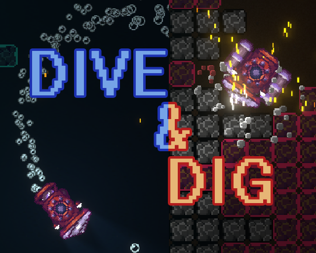

| | Title | Description | Link |
| --- | :---: | :--- | --- |
|  | **Dive & Dig** | Created in 48 hours for LD48 (Theme: Deeper and Deeper). | [Web](https://kennedy0.github.io/web_games/DiveAndDig/index.html)   [Windows](https://github.com/kennedy0/LD48/releases)   [LDJam.com](https://ldjam.com/events/ludum-dare/48/dive-dig)|
|  | **Hedge Maze** | Solve a series of mazes in a relaxing world themed around nature and seasons. | [GitHub](https://github.com/kennedy0/HedgeMaze) |
|  | **Postal Slime** | Defend the slime mailman from an onslaught of adventurers as he travels from town to town. | [GitHub](https://github.com/kennedy0/PostalSlime) |
|  | **Ludum Dare Archive** | A collection of old games that I made for Ludum Dare. | [GitHub](https://github.com/kennedy0/LudumDareArchive) |

---

